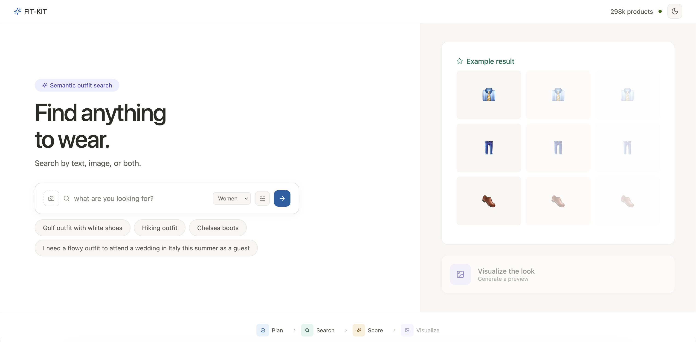

# 👕 Fit-Kit

*Fashion Intelligence Kit* - a natural language search and outfit recommender system for amazon fashion products with AI-powered try-on visualization.


[](https://github.com/user-attachments/assets/dacbf196-f62d-46da-956b-644eba4d272c)


**Tech Stack:** Python, Docker, Redis, Litestar, Taskiq, Redis Streams, gRPC, React, FashionSigLIP, OutfitTransformer, OpenAI

**Maintainer**: Jae Ro

## Table of Contents

1. [Prerequisites](#prerequisites)
2. [Run Demo](#run-demo)
3. [System Architecture](#system-architecture)
4. [API Specification](#api-specification)
5. [Methodology](#methodology)
6. [Developer Setup](#developer-setup-optional)
7. [Future Work](#future-work)
8. [References](#references)


<div style="page-break-after: always;"></div>


## Prerequisites

### Environment Variables
Ensure to set the following environment variables in the `.env` file at the root of the repo
```bash
OPENAI_API_KEY="<insert your openai api key here>"
PLATFORM="linux/arm64" # your docker os platform (e.g., don't change if running m-series mac)
```

### Required Software
* Docker + Docker Compose


### Download and Inflate Preprocessed Data
Into root of this repo
```bash
unzip fit_kit_data.zip
```

## Run Demo

```bash
docker compose --env-file .env up # this can take a few minutes on the first run
```

Navigate to [http://localhost:5173](http://localhost:5173) to view app

<div style="page-break-after: always;"></div>


## System Architecture

---


<div style="page-break-after: always;"></div>

## API Specification

### `POST /api/recommend`
Enqueue a recommendation task and stream results via SSE.

**Request Body:**
```json
{
  "query": "hiking outfit",
  "gender": "women",
  "season": "summer",
  "top_k": 24,
  "alpha": 0.8,
  "beta": 0.4,
  "filters": {
    "category": ["tops", "shoes"],
    "season": ["summer"],
    "formality": ["athletic"],
    "color": ["black", "green"]
  }
}
```

| Field | Type | Default | Description |
|-------|------|---------|-------------|
| `query` | string \| null | null | Natural language search query |
| `gender` | string \| null | null | Target demographic (`men`, `women`, `boys`, `girls`) |
| `season` | string \| null | null | "summer", "winter", "spring_fall", "all_season" |
| `top_k` | int | 24 | Results per slot (1–48) |
| `alpha` | float \| null | 0.8 | Dense vs sparse weight (0 = BM25 only, 1 = dense only) |
| `beta` | float \| null | 0.4 | Text vs image weight (0 = image only, 1 = text only) |
| `filters` | object \| null | null | Attribute filters (multiselect per field) |

<div style="page-break-after: always;"></div>

**Response:** `text/event-stream`

```
event: accepted
data: {"task_id": "64fc7b4b-..."}

event: routing
data: {"intent": "outfit", "query": "hiking outfit"}

event: plan_complete
data: {"occasion": "hiking", "slot_queries": [...], "constraints": {...}}

event: slot_result
data: {"slot_index": 0, "category": "tops", "query": "...", "products": [...]}

event: ot_scoring
data: {}

event: ot_result
data: {"outfits": [{"items": [...], "outfit_cp": 0.456}], "anchor_slot": 2}

event: complete
data: {"intent": "outfit", "total_ms": 8250.0}

event: error
data: {"message": "Timeout waiting for results"}
```

| Event | Description |
|-------|-------------|
| `accepted` | Task enqueued, includes task ID |
| `routing` | Intent classification result (`single_item` or `outfit`) |
| `plan_complete` | LLM slot plan with occasion, constraints, and per-slot queries |
| `slot_result` | Search results for one slot (sent N times for outfit, once for single_item) |
| `ot_scoring` | OutfitTransformer scoring started (outfit only) |
| `ot_result` | Scored outfits sorted by CP, best first (outfit only) |
| `complete` | All processing finished, includes total elapsed time |
| `error` | Processing failed |

---

<div style="page-break-after: always;"></div>

### `GET /api/health`
Backend and worker health check.

**Response:**
```json
{
  "status": "ok",
  "worker_ready": true
}
```

---

### `GET /api/catalog/info`
Catalog metadata.

**Response:**
```json
{
  "product_count": 298226
}
```

---

### `GET /api/images/{filename}`
Image proxy with three-layer fallback.

| Param | Type | Description |
|-------|------|-------------|
| `filename` | path | Image filename (e.g., `B07DFQPHFF.jpg`) |
| `fallback` | query | URL-encoded CDN fallback URL |

**Responses:**
- `200` — Served from disk cache (immutable headers)
- `307` — Redirect to CDN (background download triggered)
- `400` — Invalid fallback URL (not on allowed CDN hosts)
- `404` — Not found, no fallback provided

---

<div style="page-break-after: always;"></div>


### `GET /api/products/{asin}`
Full product details for modal display. Results cached in Redis (1hr TTL).

**Response:**
```json
{
  "asin": "B07DFQPHFF",
  "title": "True Original Nine-Iron Grey 11.5",
  "features": ["Leather upper", "Rubber sole", "..."],
  "details": {"Department": "Mens", "Material": "Leather"},
  "reviews": [
    {
      "title": "Great shoes",
      "text": "Very comfortable for walking the course...",
      "rating": 5,
      "helpful_votes": 12
    }
  ]
}
```

---

### `POST /api/score-outfit`
Score a user-assembled outfit for compatibility. Enqueues task, polls Redis for result.

**Request Body:**
```json
{
  "asins": ["B07DFQPHFF", "B08T5P16JM", "B07TW4KNX5"]
}
```

**Response:**
```json
{
  "outfit_cp": 0.423
}
```

| Error | Description |
|-------|-------------|
| `{"outfit_cp": 0.0, "error": "Need at least 2 items"}` | Fewer than 2 ASINs provided |
| `{"outfit_cp": 0.0, "error": "Scoring timeout"}` | Worker didn't respond within 5s |

---

### `POST /api/visualize`
Generate an AI try-on image using OpenAI Responses API.

**Request Body:**
```json
{
  "asins": ["B07DFQPHFF", "B08T5P16JM", "B07TW4KNX5"],
  "query": "hiking outfit",
  "occasion": "hiking",
  "gender": "women"
}
```

**Response:**
```json
{
  "image": "<base64-encoded PNG>"
}
```

| Error | Description |
|-------|-------------|
| `{"error": "No items provided"}` | Empty ASINs list |
| `{"error": "No image generated in response"}` | OpenAI returned no image |
| `{"error": "..."}` | OpenAI API error details |


<div style="page-break-after: always;"></div>


## Methodology

### Data Preparation
1. Download product metadata and join with product reviews where available and filter based on basic criteria (Total Remaining `~298k` Products)
2. Process the product text content (e.g., titles, features, reviews, etc) into a `rich_text` string per product to be embedded
3. Download product images (first image in list of image urls) and store to disk
4. Run `Marqo/marqo-fashionSigLIP` model to embed both product text and image content and save to `image_embeddings.safetensors` and `text_embeddings.safetensors`
5. Use the same `Marqo/marqo-fashionSigLIP` model to run zero-shot multi-class classification to enrich product metatadata with attributes (e.g., category="tops", or formality="casual"). 
    * Define descriptive prompts for each class
        ```python
        CLIP_CATEGORIES = [
            ("tops", "a shirt, blouse, tee, or top"),
            ("shoes", "shoes, boots, sneakers, sandals, heels, or slippers"),
            ("bags", "a handbag, purse, backpack, wallet, or tote"),
            # ... 21 total
        ]
        ```
    * Encode the class prompts. Run each descriptive text through `Marqo/marqo-fashionSigLIP` text encoder to get a 768-dim embedding per class. This gives you a matrix of shape (21, 768) — one row per category.
        ```python
        tokens = tokenizer(["a shirt, blouse, tee, or top", "shoes, boots, sneakers...", ...])
        cat_feats = model.encode_text(tokens)  # (21, 768)
        cat_feats = cat_feats / cat_feats.norm(dim=-1, keepdim=True)  # L2 normalize
        ```
    * Encode each product. Build an enriched text (title + features + details) and encode it through the same text encoder
        ```python
        rich_features = model.encode_text(tokenizer(rich_texts))  # (batch, 768)
        ```
    * Calculate Cosine similarity between product text embedding and class definition prompt embedding. The class with highest similarity determines the label
       
       <div style="page-break-after: always;"></div>

        ```python
        sims = 100.0 * rich_features @ cat_feats.T  # (batch, 21)
        cat_indices = sims.argmax(dim=-1) # (batch,) — best category per product
        ```
    * Repeat the process but only for `color` for image embeddings. We double down on `color` using both text and images because it can often be the case that the text describing a product may not be an accurate indication of what color the product image shows, which is why we rely heavily on vision for this aspect of shopping.

### Outfit Compatibility Scoring
1. We train an OutfitTransformer (see reference link in [references](#references)) using our pretrained `Marqo/marqo-fashionSigLIP` model encoder instead of the original CLIP model the original author proposed on the `polyvore` fashion dataset The OutfitTransformer treats an outfit as a set of item embeddings (concatenated image + text, 1536-dim per item) and runs a transformer encoder over the set, and predicts a single compatibility (CP) score for the outfit as a whole (bidirectional self-attention where a CLS token prepended to the item sequence, and the CLS output fed into a classification head for the compatibility score).
2. We use separately provided labeled "good" outfit combinations (`owj0421/polyvore-outfits`) as positive samples, and then swapping out items per category to produce hard negative samples
3. We follow the original paper's methodology of treating the problem as binary classification (compatible or not) and using FocalLoss as our loss function (although it could be argued BCE would perform similarly)
4. We measure training stopping criteria based on lowest validation loss on `owj0421/polyvore-outfits` validation set (train/val/test sets pre-split)
5. We save the best model to use on our amazon fashion products dataset

### Retrieval & Inference
1. BM25 index is created on a concatenation of core product text and review text per product item
2. We use kNN search for exact nearest neighbor vector search (dot product because all vectors are L2 normalized) because the dataset is small enough where we don't need to utilize ANN methods like HNSW or IVF.
    * Reduces index build time (just load vectors) instead of building graph or running clustering
    * Provides reliable nearest neighbor search confidence
    * Gives us a bit more flexibility to weight across image and text modalities to define a single aggregate dense search score/ranking (`beta` blends the text and image modalities into a single dense score using `β · text + (1-β) · image` )
    * With Pre-filtering, exact kNN search gets faster as the selectivity produces smaller search space
3. Hybrid search results (sparse + dense) are then run through a weighted Reciprocal Rank Fusion algorithm to produce a fused rank-based ordered candidate set (where `alpha` blends sparse and dense candidate ranks `RRF_score(doc) = α / (k + rank_dense(doc)) + (1-α) / (k + rank_sparse(doc))`)
4. We then oversample top-k (`k * 10`) during retrieval to provide headroom for deduplication of near-identical product listings, then return the top-k unique results.
5. We use a simple semantic router (again using `Marqo/marqo-fashionSigLIP` encoder) to determine if a user's query is searching for a `single_item` vs `outfit`.
    * If `single_item` we route directly to hybrid search (very fast `ms`)
    * If `outfit`, we route to our LLM-based Outft `SlotPlanner`
6. For `outfit` queries, we use the LLM to understand the intent of the user's query with prepended user context (e.g, `shopping in men's department`) and provide a plan in terms of:
    * number of slots needed to complete the outfit along with what category each of those slots ought to be filled with (e.g., shirts, shoes, belts, etc.)
    * filters that need to be run (overall and per slot)
    * a decomposed and expanded search query per output slot

    ```yaml
    Input:
    query: "hiking outfit"
    context: gender=women

    LLM Structured Output:
        constraints:
            gender: women
            season: spring_fall
        occasion: hiking
        slot_queries:
          - category: [tops]
            query: "women's moisture-wicking hiking top"
            formality: [athletic]
            color: [green, grey]
          - category: [pants]
            query: "women's lightweight hiking pants"
            formality: [athletic]
            color: [khaki, black]
          - category: [shoes]
            query: "women's waterproof hiking boots"
            formality: [athletic]
            color: [brown, black]
          - category: [outerwear]
            query: "women's packable rain jacket"
            formality: [athletic]
            color: [navy, green]
    ```
7. We run OutfitTransformer using an anchored greedy search approach (e.g, anchoring the search on a given slot like `shoes`) and then running iterative forward passes where we pick the best item per slot conditioned on previously selected items per slot (starting with anchor slot)
    * This significantly reduces the computation from the total number of outfit combinations to be score from `O(k^n_slots)` to `O(n_anchors * (n_slots-1) * k)`


## Developer Setup (Optional)

```bash
# uv python install 3.12.13
uv venv
source .venv/bin/activate
uv sync --all-groups --all-extras
```

### Download Raw Data 

```bash
huggingface-cli download McAuley-Lab/Amazon-Reviews-2023 \
    --include "raw/meta_Amazon_Fashion.jsonl.gz" \
    --include "raw/review_categories/Amazon_Fashion.jsonl" \
    --local-dir data/
```

### Explore Dataset
```bash
python scripts/explore_dataset.py \
    --analyze \
    --download \
    --path data/raw/meta_Amazon_Fashion.jsonl.gz
```

### Prepare Catalog (Feature Engineering + Embedding + Indexing)
```bash
python scripts/prepare_catalog_amazon.py \
    --path data/raw/meta_Amazon_Fashion.jsonl.gz \
    --reviews-path data/raw/review_categories/Amazon_Fashion.jsonl \
    --output-dir data/catalog \
    --device cpu \
    --batch-size 128 \
    --image-batch-size 64 \
    --download-workers 16 \
    --min-rating 3.5 \
    --min-reviews 5 \
    --max-products 1000 # only set this if you want to limit number of products we index
```

### Evaluate System Against Amazon C4 Dataset
[https://huggingface.co/datasets/McAuley-Lab/Amazon-C4](https://huggingface.co/datasets/McAuley-Lab/Amazon-C4)

```bash
export OPENAI_API_KEY="<insert your OPENAI API key here>"
python scripts/eval_c4.py
```

Note: Amazon-C4 ground truth is based on co-purchase data, not outfit compatibility. A semantically relevant result that wasn't co-purchased counts as a miss, which deflates these metrics relative to perceived quality.

## Future Work
1. Experiment with a `CrossEncoder` reranker to rerank coarse candidate retrieval (`top_k * 10`) in hopes of producing a finer, more relevant top-k candidate set for OutfitTransformer to pick better outfits from 
2. Fine-tune our pretrained Outfit Transformer on labeled positive and (hard) negative outfit samples from our Amazon fashion product dataset to provide a more relevant notion of a "compatible" outfit with respect to distribution of product text and images
3. Personalization - Create feature for users to be able to "save" outfits that they like and maybe even downvote outfits that were highly recommended, but were actually not to their taste (or even realistically super coherent). This can be double dipped to be used for training data as well (maybe even tailored per user -- model per user)
4. Scalability - currently we are running the OutfitTransformer model directly in our taskiq worker, but this may want to be its own decoupled batched inference service with something like Triton/TensorRT to scale to higher number of concurrent requests per second
5. Performance - much of the outfit latency is taken by the LLM calls (planning ~ `3-5s`, outfit image gen viz ~ `30-60s`). Can we tailor a smaller image gen model or slot planner model to be able to decrease the tail latency for outfit requests? 
    * Additionally, some cheap gains would be to decrease input image dims to the image gen model. 
    * Maybe even use a lighter model (e.g, `gpt-4o-mini`)

## References

Data Source References:
* [https://huggingface.co/datasets/McAuley-Lab/Amazon-Reviews-2023](https://huggingface.co/datasets/McAuley-Lab/Amazon-Reviews-2023)
* [https://huggingface.co/datasets/McAuley-Lab/Amazon-C4](https://huggingface.co/datasets/McAuley-Lab/Amazon-C4)
* [https://huggingface.co/datasets/Marqo/polyvore](https://huggingface.co/datasets/Marqo/polyvore)
* [https://huggingface.co/datasets/owj0421/polyvore-outfits](https://huggingface.co/datasets/owj0421/polyvore-outfits)

Model References:
* [https://huggingface.co/Marqo/marqo-fashionSigLIP](https://huggingface.co/Marqo/marqo-fashionSigLIP)
* [OutfitTransformer Research Paper](https://arxiv.org/abs/2204.04812)
* [OutfitTransformer Implementation](https://github.com/bigohofone/outfit-transformer)
